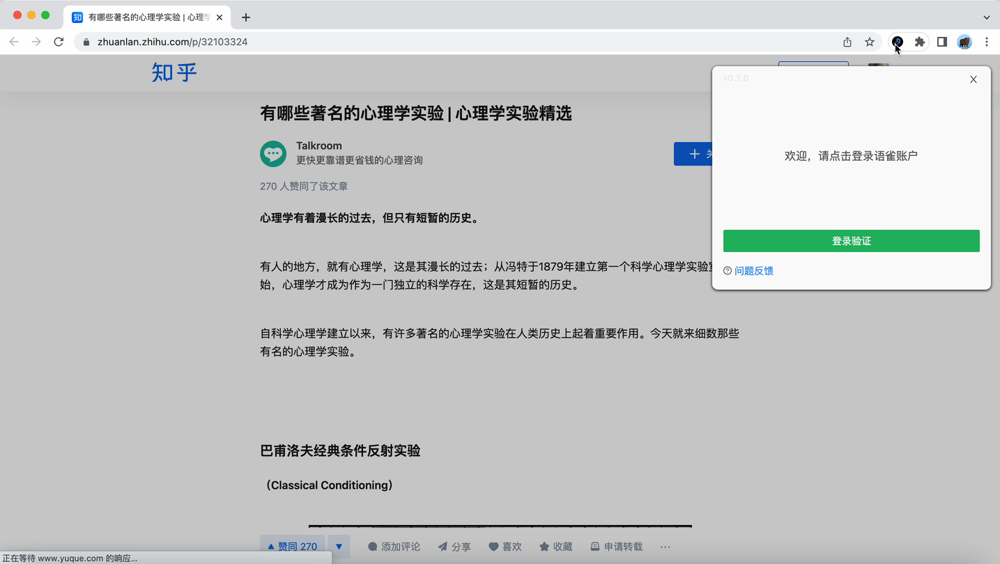

# Chrome 插件

---

[English](README.en.md)

<p align="center">
  <a href="https://www.yuque.com/xudafeng/yuque-chrome-extension/welcome">
    
  </a>
</p>

## 插件说明

<p align="center">
  
</p>

文档说明：https://www.yuque.com/xudafeng/yuque-chrome-extension/welcome

## 如何开发

```bash
# 安装 npm 依赖
$ npm install

# 启动开发环境
$ npm run dev
```


<!-- GITCONTRIBUTOR_START -->

## Contributors

|[<br/><sub><b>TbabmBarry</b></sub>](https://github.com/TbabmBarry)<br/>|[<br/><sub><b>xudafeng</b></sub>](https://github.com/xudafeng)<br/>|
| :---: | :---: |


This project follows the git-contributor [spec](https://github.com/xudafeng/git-contributor), auto updated at `Mon Jul 10 2023 22:04:24 GMT+0800`.

<!-- GITCONTRIBUTOR_END -->
