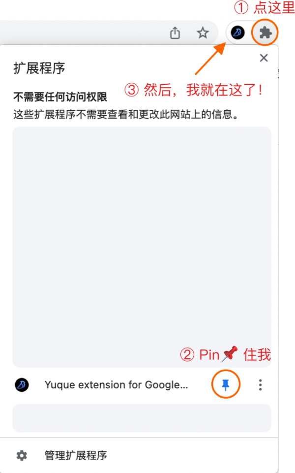

# 语雀浏览器插件

> 支持 Chrome/Edge

---

[English](README.en.md)

[![CI][ci-image]][ci-url]

[ci-image]: https://github.com/yuque/yuque-chrome-extension/actions/workflows/ci.yml/badge.svg
[ci-url]: https://github.com/yuque/yuque-chrome-extension/actions/workflows/ci.yml

<p align="center">
  <a href="https://www.yuque.com/yuque/yuque-browser-extension/welcome">
    
  </a>
</p>

## 插件说明

<p align="center">
  
</p>

<p align="center">
  
</p>

文档说明：https://www.yuque.com/yuque/yuque-browser-extension/welcome

## 如何开发

```bash
# 安装 npm 依赖
$ npm install

# 启动开发环境
$ npm run dev

# 发布版本
$ npm run release
```




<!-- GITCONTRIBUTOR_START -->

## Contributors

|[<br/><sub><b>TbabmBarry</b></sub>](https://github.com/TbabmBarry)<br/>|[<br/><sub><b>xudafeng</b></sub>](https://github.com/xudafeng)<br/>|[<br/><sub><b>vagusX</b></sub>](https://github.com/vagusX)<br/>|[<br/><sub><b>snapre</b></sub>](https://github.com/snapre)<br/>|
| :---: | :---: | :---: | :---: |


This project follows the git-contributor [spec](https://github.com/xudafeng/git-contributor), auto updated at `Fri Jul 14 2023 22:32:27 GMT+0800`.

<!-- GITCONTRIBUTOR_END -->
